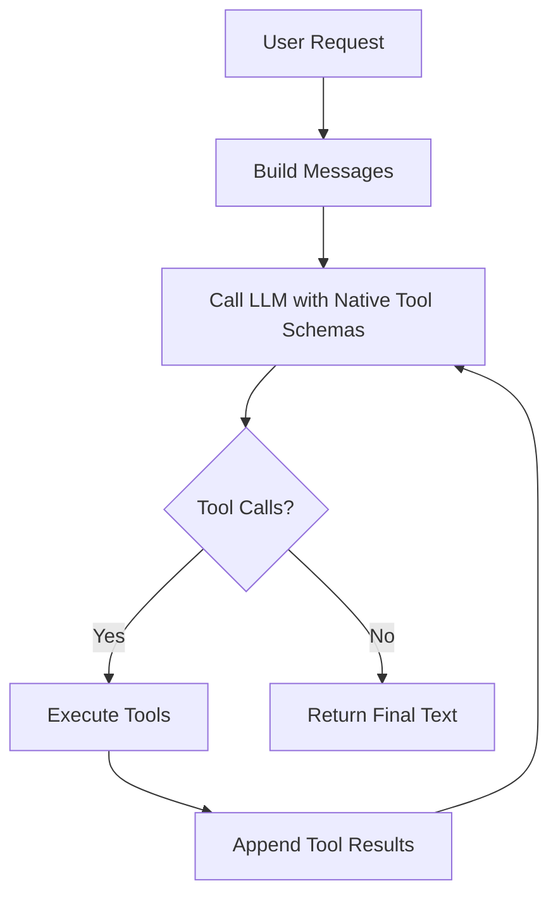
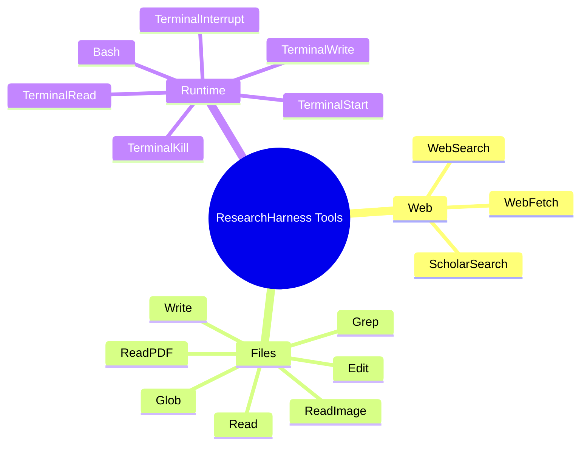

<div align="center">

# 🔬 ResearchHarness

**A trusted-local harness for research agents with real tool use, end-to-end evaluation, and training-data collection.**

[](LICENSE)
[](https://www.python.org/)
[](#-how-it-works)
[](#-trace-format)
[](#-scope)

</div>

ResearchHarness is a compact harness for running a tool-using LLM against real local and web tasks. It is built for **agent execution**, **end-to-end evaluation**, and **training-data collection**.

Unlike large agent platforms, this project is intentionally centered on:

- real tools instead of mocked capabilities
- a deterministic public interface
- readable CLI execution
- repeatable end-to-end evaluation
- flat traces that can be directly turned into SFT-style training data

The point is not to build a giant orchestration layer. The point is to keep a **small, inspectable harness** that is easy to run, easy to debug, and easy to train from.

---

## 📚 Table of Contents

- [✨ Highlights](#-highlights)
- [🧭 Scope](#-scope)
- [⚡ Quick Start](#-quick-start)
- [🧠 How It Works](#-how-it-works)
- [🛠 Tool Surface](#-tool-surface)
- [🗂 Workspace Model](#-workspace-model)
- [🖼 PDF and Image Flow](#-pdf-and-image-flow)
- [🧾 Trace Format](#-trace-format)
- [🧪 Testing](#-testing)
- [🏗 Project Structure](#-project-structure)
- [⚠️ Known Boundaries](#️-known-boundaries)
- [🪪 License](#-license)

---

## ✨ Highlights

- **Native tool calling**
  The harness uses OpenAI-compatible native tool calling instead of a custom text protocol.
- **Harness-first design**
  The project stays intentionally small: one main loop, a focused tool surface, readable CLI output, and flat traces.
- **Plugins**
  Domain-specific behavior can be layered on top of the base harness without changing the default general-purpose prompt.
- **Workspace-first execution**
  Local paths, shell execution, and file discovery all start from one explicit workspace root.
- **Strong local tools**
  File discovery, file reads, PDF reads, image inspection, shell execution, and persistent terminal sessions are all available.
- **Training-friendly traces**
  Runs are recorded as a flat JSONL event stream that can be directly reused to collect supervised training data.
- **End-to-end evaluation**
  The repo validates actual multi-step agent behavior, not just isolated tool calls.
- **PDF-to-figure workflow**
  `ReadPDF` can expose extracted image paths, and `ReadImage` can inspect the actual extracted figure file.

### At a Glance

| Area | What ResearchHarness focuses on |
| --- | --- |
| Runtime | Small native tool-calling harness loop |
| Plugins | Optional domain-specific prompt layers |
| Local work | Workspace-first file and shell operations |
| Evaluation | Repeatable end-to-end evaluation |
| Data | Flat JSONL traces for training-data collection |
| Deployment model | Trusted-local, not public-safe |

---

## 🧭 Scope

ResearchHarness is a **trusted-local harness** for research agents.

It is suitable for:

- local research workflows
- tool-use evaluation
- agent evaluation
- trace collection for training
- controlled internal experimentation

It is **not** a public-safe sandboxed service.

It is also intentionally **not** trying to be:

- a large workflow engine
- a multi-tenant serving platform
- a kitchen-sink agent product
- a deeply abstract orchestration framework

The current tool surface intentionally includes strong local capabilities such as:

- `Bash`
- `Terminal*`
- `Write`
- `Edit`

If you need a public deployment boundary, that should be added as a separate layer rather than assumed from this repository. This repo should be read as a **harness**, not a platform.

---

## ⚡ Quick Start

### 1. Install

Use any Python environment manager you prefer:

- `venv`
- `conda`
- `uv`
- system Python

Install dependencies:

```bash
python3 -m pip install -r requirements.txt
```

### 2. Configure

Copy `.env.example` to `.env` and fill in the keys you need.

Important variables:

- `API_KEY`
- `API_BASE`
- `MODEL_NAME`
- `SUMMARY_MODEL_NAME`
- `WORKSPACE_ROOT`
- `SERPER_KEY_ID`
- `JINA_API_KEYS`
- `MINERU_TOKEN`
- `PLUGINS` (optional, comma-separated plugin names)

Minimal example:

```env
API_KEY=your_api_key
API_BASE=https://your-openai-compatible-endpoint/v1
MODEL_NAME=gpt-5.4
SUMMARY_MODEL_NAME=gpt-5.4
WORKSPACE_ROOT=./workspace
```

Capability-specific requirements:

- `WebSearch` / `ScholarSearch` require `SERPER_KEY_ID`
- `WebFetch` requires `JINA_API_KEYS`
- `ReadPDF` requires `MINERU_TOKEN` and `structai`

### 2.5 Optional Plugins

The harness keeps the base system prompt general-purpose. Domain-specific behavior can be added through plugins.

Current built-in plugin:

- `academic_research` — adds stronger guidance for literature survey, idea generation, experiment design, iterative phase gates, persistent research state, and evidence-grounded reporting

Enable via environment variable:

```env
PLUGINS=academic_research
```

Or enable per run:

```bash
python3 -m agent_base.react_agent "your question" --plugin academic_research
```

The legacy names `PROMPT_PLUGINS` and `--prompt-plugin` are still accepted for compatibility.

Inspect available plugins:

```bash
python3 -m agent_base.prompt --list-plugins
python3 -m agent_base.prompt --show-plugin academic_research
```

### 3. Run

Run the agent directly:

```bash
python3 -m agent_base.react_agent "Who proposed the transformer architecture, and in what year was the paper published?"
```

Save a trace:

```bash
python3 -m agent_base.react_agent "your question" --save-path workspace/manual_runs/trace.jsonl
```

Use an explicit workspace:

```bash
python3 -m agent_base.react_agent "summarize this project" --workspace-dir /path/to/workspace
```

Run with the academic research plugin:

```bash
python3 -m agent_base.react_agent "investigate this research task" \
  --workspace-dir /path/to/workspace \
  --plugin academic_research
```

---

## 🧠 How It Works

ResearchHarness follows a deliberately simple harness loop:



The public harness API stays intentionally small:

```python
result_text = agent.run(user_input, workspace_dir=None)
```

Properties:

- `user_input`: the user request string
- `workspace_dir`: optional workspace directory
- return value: exactly one final text string

Model config, retry policy, trace path, and runtime controls are initialization-time settings, not `run(...)` arguments.

### 🖥 CLI Output

The CLI is not limited to a final one-line answer.

During execution it prints:

- model name
- workspace path
- user request
- per-round assistant output
- tool calls
- tool results
- runtime correction messages when a turn is invalid

This makes direct harness runs readable without requiring debug-only logs.

---

## 🛠 Tool Surface

### Web and Retrieval

- `WebSearch`
- `ScholarSearch`
- `WebFetch`

### Local Files

- `Glob`
- `Grep`
- `Read`
- `ReadPDF`
- `ReadImage`
- `Write`
- `Edit`

### Local Execution

- `Bash`
- `TerminalStart`
- `TerminalWrite`
- `TerminalRead`
- `TerminalInterrupt`
- `TerminalKill`

More detailed tool documentation lives in [agent_base/tools/README.md](agent_base/tools/README.md).



---

## 🗂 Workspace Model

The harness uses a single workspace concept.

- `WORKSPACE_ROOT` defines the default workspace
- `run(..., workspace_dir=...)` overrides it for that run
- relative local file paths resolve from the workspace
- `Bash` and `TerminalStart` start from the workspace by default

The repository includes a committed [workspace/.gitkeep](workspace/.gitkeep) so the directory exists in Git, while runtime artifacts inside `workspace/` remain ignored.

---

## 🖼 PDF and Image Flow

### `ReadPDF`

`ReadPDF` is designed for PDF structure and extracted content. It returns:

- extracted text
- extracted local image paths when the parser provides them

Recommended PDF-figure workflow:

1. use `ReadPDF`
2. inspect the returned `image_paths`
3. pass the selected image path to `ReadImage`

### `ReadImage`

`ReadImage` returns image metadata and, during the main agent run, attaches a compressed image as a standard `image_url` content part for the model request.

This is the standard OpenAI-compatible multimodal request shape used by this repository for local images.

---

## 🧾 Trace Format

Traces are written as a flat JSONL event stream.

Every row uses the same keys:

- `run_id`
- `event_index`
- `turn_index`
- `timestamp`
- `model_name`
- `workspace_root`
- `role`
- `text`
- `tool_call_ids`
- `tool_names`
- `tool_arguments`
- `finish_reason`
- `termination`
- `error`
- `image_paths`

### Why flat traces?

- easier to replay
- easier to diff
- easier to turn into supervised training data
- no secondary export format required

The trace includes:

- system prompt
- user input
- assistant tool-call turns
- tool results
- runtime-injected messages
- final assistant text

In practice, this means the harness can be used not only to run agents, but also to **collect training data** from real tool-using trajectories.

---

## 🧪 Testing

The harness includes both tool-level checks and end-to-end agent tests.

Test scripts default to the current interpreter. If you want child processes to use a specific interpreter, set:

```bash
RESEARCHHARNESS_TEST_PYTHON="/path/to/your/python"
```

### Tool availability

```bash
python3 test/test_tool_availability.py --json
```

### Local tool validation

```bash
python3 test/test_local_tools_validation.py
```

### Direct toolchain validation

```bash
python3 test/test_toolchain_validation.py
```

### End-to-end multi-tool test

```bash
python3 test/test_end_to_end_multitool.py
```

### End-to-end local file discovery test

```bash
python3 test/test_end_to_end_glob_grep.py
```

### End-to-end write/edit test

```bash
python3 test/test_end_to_end_write_edit.py
```

### End-to-end terminal-session test

```bash
python3 test/test_end_to_end_terminal.py
```

### End-to-end online PDF first-figure test

```bash
python3 test/test_end_to_end_pdf_image.py
```

Fixed local fixtures live under [test/example_files/](test/example_files).

---

## 🏗 Project Structure

### Core runtime

- [agent_base/react_agent.py](agent_base/react_agent.py)
- [agent_base/prompt.py](agent_base/prompt.py)
- [agent_base/trace_utils.py](agent_base/trace_utils.py)
- [agent_base/console_utils.py](agent_base/console_utils.py)

### Tools

- [agent_base/tools/tool_file.py](agent_base/tools/tool_file.py)
- [agent_base/tools/tool_runtime.py](agent_base/tools/tool_runtime.py)
- [agent_base/tools/tool_web.py](agent_base/tools/tool_web.py)
- [agent_base/tools/README.md](agent_base/tools/README.md)

### Tests and fixtures

- [test/test_tool_availability.py](test/test_tool_availability.py)
- [test/test_local_tools_validation.py](test/test_local_tools_validation.py)
- [test/test_toolchain_validation.py](test/test_toolchain_validation.py)
- [test/test_end_to_end_multitool.py](test/test_end_to_end_multitool.py)
- [test/test_end_to_end_glob_grep.py](test/test_end_to_end_glob_grep.py)
- [test/test_end_to_end_write_edit.py](test/test_end_to_end_write_edit.py)
- [test/test_end_to_end_terminal.py](test/test_end_to_end_terminal.py)
- [test/test_end_to_end_pdf_image.py](test/test_end_to_end_pdf_image.py)
- [test/example_files/](test/example_files)
- [test/cases/](test/cases)

### Runtime workspace

- [workspace/](workspace)

---

## ⚠️ Known Boundaries

- This repository is **not sandboxed**
- `ReadPDF` depends on `structai` and `MINERU_TOKEN`
- `ReadImage` currently sends compressed local images as inline `data:` URLs through standard `image_url` request parts
- Real LLM behavior is still the least deterministic part of the system, even with native tool calling and test coverage

---

## 📦 What Has Been Removed

The repository has been intentionally narrowed to the current harness.

Removed from the active code path:

- remote Python sandbox integrations
- Alibaba cloud document pipelines
- video parsing paths
- unrelated batch inference components
- the older text-tag tool protocol in the main runtime path

---

## 🌍 Open Source Notes

- `.env` is ignored
- runtime artifacts inside `workspace/` are ignored
- traces are ignored unless you intentionally move them elsewhere
- `AGENTS.md` is intentionally local-only

The repository includes:

- [LICENSE](LICENSE)
- [.env.example](.env.example)
- committed example files for tests
- a committed workspace directory placeholder

---

## 🪪 License

This project is released under the [MIT License](LICENSE).
