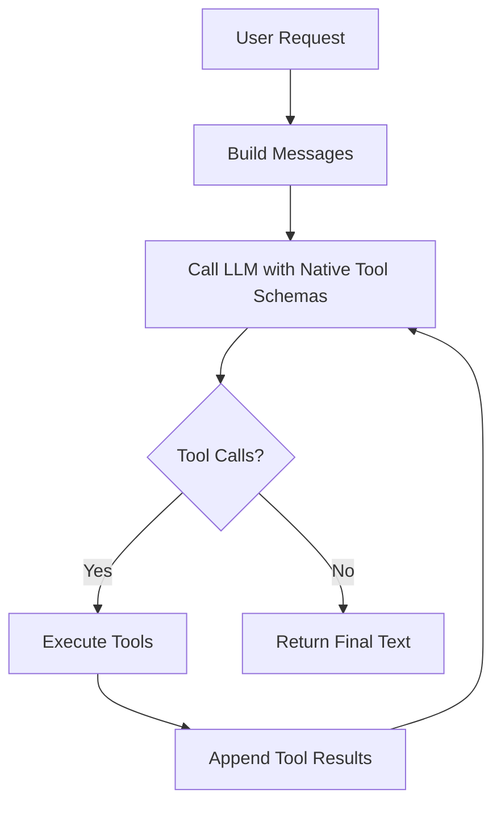
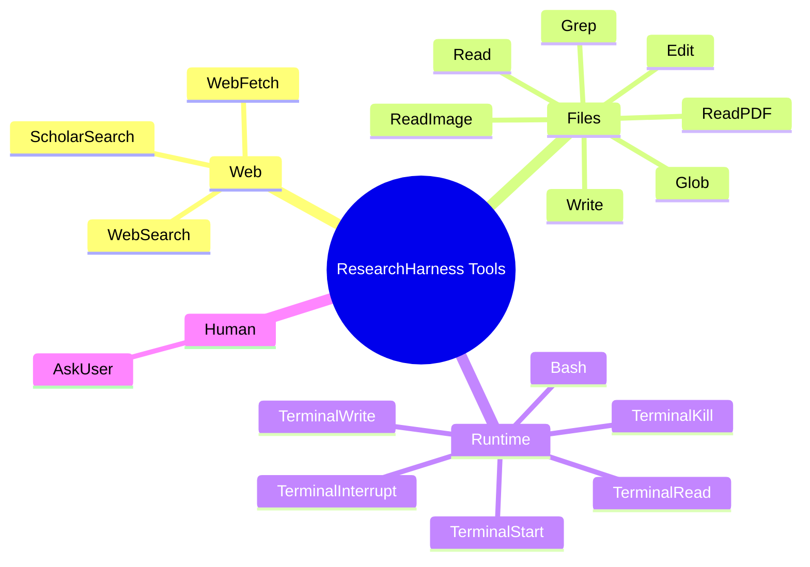

<div align="center">

# 🔬 ResearchHarness

**A lightweight, general-purpose harness for tool-using LLM agents.**

[](LICENSE)
[](https://www.python.org/)
[](#-highlights)
[](https://github.com/InternScience/MarkScientist)
[](#-how-it-works)
[](#-trace-format)
[](https://github.com/InternScience/ResearchClawBench)

</div>

ResearchHarness is a foundational harness for running tool-using LLM agents on real local and web tasks. It is designed to be **general**, **stable**, **fair**, **lightweight**, and **feature-complete**.

It serves three practical roles:

1. a **fair execution substrate for agent benchmarks** such as [ResearchClawBench](https://github.com/InternScience/ResearchClawBench)
2. a **reference baseline and meta harness** for future harness optimization
3. a **lightweight personal assistant runtime** for coding, file work, and report writing

The goal is not novelty for its own sake. The goal is to provide a small, inspectable agent harness that is easy to run, easy to compare, easy to extend, and easy to trust as infrastructure.

---

## 📚 Table of Contents

- [✨ Highlights](#-highlights)
- [📰 News](#-news)
- [🧭 Positioning](#-positioning)
- [⚡ Quick Start](#-quick-start)
- [🚀 OpenAI-Compatible API Deployment](#-openai-compatible-api-deployment)
- [🧠 How It Works](#-how-it-works)
- [🛠 Tool Surface](#-tool-surface)
- [🗂 Workspace Model](#-workspace-model)
- [🖼 PDF and Image Flow](#-pdf-and-image-flow)
- [🧾 Trace Format](#-trace-format)
- [🧪 Testing](#-testing)
- [🏗 Project Structure](#-project-structure)
- [⚠️ Known Boundaries](#️-known-boundaries)
- [🪪 License](#-license)

---

## ✨ Highlights

- **Native tool calling**
  The harness uses OpenAI-compatible native tool calling instead of a custom text protocol.
- **OpenAI-compatible API serving**
  ResearchHarness can be deployed behind `/v1/chat/completions`, so existing OpenAI SDK clients can call it as a tool-using agent backend.
- **General model support**
  The runtime is built around OpenAI-compatible chat-completions APIs, which makes it straightforward to use GPT, Gemini, Qwen, GLM, and other model families when exposed through that interface.
- **Fair benchmark substrate**
  The project is well-suited to benchmark evaluation because the runtime contract stays explicit, stable, and lightweight.
- **Baseline and meta harness**
  ResearchHarness can act as a reference baseline today and as the harness-under-test when you later optimize prompts, loop policies, tool behavior, or benchmark adapters.
- **Lightweight but complete**
  One main loop, a focused tool surface, readable CLI output, and flat traces cover real agent work without turning the repository into a large platform.
- **Extensible agent base**
  Upper-layer frameworks can subclass the base ReAct agent and append role-specific prompt blocks without rewriting the execution loop.
- **Workspace-first execution**
  Local paths, shell execution, and file discovery all start from one explicit workspace root.
- **Full tool surface**
  File discovery, file reads, PDF reads, image inspection, shell execution, and persistent terminal sessions are all available in one compact runtime.
- **End-to-end evaluation**
  The repo validates actual multi-step agent behavior, not just isolated tool calls.
- **PDF-to-figure workflow**
  `ReadPDF` can expose extracted image paths, and `ReadImage` can inspect the actual extracted figure file.

---

## 📰 News

- **2026-05-12: OpenAI-compatible API server**
  ResearchHarness can now be deployed as a synchronous `/v1/chat/completions` service. Existing OpenAI SDK clients can send plain-text or multimodal requests, while the server creates an isolated workspace per request and uses input/output LLM wrappers to keep agent execution stable and final answers format-compliant.
- **2026-04-30: Interactive `AskUser` tool**
  ResearchHarness now includes an `AskUser` native tool for essential human clarification in interactive runs, while the ResearchClawBench adapter explicitly excludes it to keep benchmark runs non-interactive.
- **2026-04-30: Workspace roots are created automatically**
  Explicit `workspace_root` paths are now created at run startup when missing, while tool path resolution still stays bounded inside the workspace.
- **2026-04-25: Automatic context compaction for long runs**
  ResearchHarness now supports built-in context compaction for long multi-step tasks instead of relying only on a growing raw message list.
- **2026-04-25: Configurable compaction trigger**
  The default compaction trigger is `128k`, and you can override it with `AUTO_COMPACT_TRIGGER_TOKENS=16k` or `llm.generate_cfg["compact_trigger_tokens"] = "32k"`.
- **2026-04-25: Training-ready trace capture**
  The existing `trace_*.jsonl` format now records full `llm_call` and `compaction` payloads in the same file, so reasoning context, tool environment, and memory-compression steps can all be reused for training or distillation.
- **2026-04-25: Preserved compact memory**
  Compaction outputs are still written into session state, and the trace now captures the compaction request/response path as an explicit training event.

### At a Glance

| Area | What ResearchHarness focuses on |
| --- | --- |
| Positioning | Foundational harness, not a workflow platform |
| Models | GPT, Gemini, Qwen, GLM, and other OpenAI-compatible LLMs |
| Runtime | Small native tool-calling harness loop |
| Evaluation | Repeatable and benchmark-friendly execution |
| Extensibility | Base agent plus role-specific prompt addenda |
| Personal use | Coding, file processing, report writing, and local agent work |
| Data | Flat JSONL traces for debugging, replay, and optional training reuse |

---

## 🧭 Positioning

ResearchHarness should be understood as a **base harness**.

It is a good fit when you need:

- a common and fair runtime for benchmark evaluation
- a compact baseline for harness research and optimization
- a lightweight personal agent for day-to-day work
- a readable execution loop with real tools and real artifacts
- a stable interface that is easy to debug and compare

It is intentionally **not** trying to be:

- a large workflow engine
- a multi-tenant serving platform
- a deeply abstract orchestration framework
- a kitchen-sink agent product

Instead, it keeps the core contract small and concrete:

- one main ReAct loop
- one explicit workspace root
- one readable CLI entrypoint
- one flat trace format
- one focused but capable tool surface

If you need stricter security isolation or product-specific orchestration, those should be added as separate layers around the harness rather than folded into the core runtime.

### Three Common Uses

| Use | Why ResearchHarness fits |
| --- | --- |
| Fair benchmark base | It keeps the runtime contract explicit and lightweight, which is useful for benchmarks such as ResearchClawBench. |
| Baseline and meta harness | It is small enough to inspect and modify, making it a practical reference baseline and an object of optimization itself. |
| Personal assistant | It already includes file, shell, PDF, image, and report-oriented workflows, so it is useful outside benchmark settings too. |

---

## ⚡ Quick Start

### 1. Install

Use any Python environment manager you prefer:

- `venv`
- `conda`
- `uv`
- system Python

Install dependencies:

```bash
python3 -m pip install -r requirements.txt
```

### 2. Configure

Copy `.env.example` to `.env` and fill in all required variables.

ResearchHarness currently talks to OpenAI-compatible chat-completions APIs. In practice, that means GPT, Gemini, Qwen, GLM, and other model families can be used when they are exposed through a compatible endpoint.

> [!IMPORTANT]
> **🚨 Required setup before running ResearchHarness**
>
> Fill in all required environment variables before starting the agent:
> `API_KEY`, `API_BASE`, `MODEL_NAME`, `SERPER_KEY_ID`, `JINA_API_KEYS`, and `MINERU_TOKEN`.
>
> Service key sources:
> - LLM provider key and endpoint: your OpenAI-compatible provider.
> - Serper API key for `WebSearch` and `ScholarSearch`: https://serper.dev/
> - Jina API key for `WebFetch`: https://jina.ai/
> - MinerU token plus [`structai`](https://github.com/black-yt/structai) for `ReadPDF`: https://mineru.net/
>
> Before using ResearchHarness for real tasks, run the full tool availability check and require every tool to pass:
>
> ```bash
> python3 tests/test_tool_availability.py
> ```
>
> The expected result is all tools passing. Missing credentials, missing dependencies, exhausted service credits, or unavailable external tools should be treated as failures, not skipped checks.
> If `WebSearch`, `ScholarSearch`, `WebFetch`, or `ReadPDF` fails with network, TLS, upload, download, or parsing errors, retry with VPN/proxy disabled.

Required variables:

- `API_KEY`
- `API_BASE`
- `MODEL_NAME`
- `SERPER_KEY_ID`
- `JINA_API_KEYS`
- `MINERU_TOKEN`

Optional variables:

- `WORKSPACE_ROOT`
- `MAX_LLM_CALL_PER_RUN`
- `MAX_AGENT_ROUNDS`
- `MAX_AGENT_RUNTIME_SECONDS`
- `LLM_TIMEOUT_SECONDS`
- `LLM_MAX_OUTPUT_TOKENS`
- `MAX_INPUT_TOKENS`
- `LLM_MAX_RETRIES`
- `TEMPERATURE`
- `TOP_P`
- `PRESENCE_PENALTY`
- `AUTO_COMPACT_TRIGGER_TOKENS`
- `IMAGE_PART_TOKEN_ESTIMATE`
- `LLM_IMAGE_MAX_EDGE`
- `LLM_IMAGE_MAX_BYTES`
- `LLM_IMAGE_JPEG_QUALITY`
- `DEBUG_AGENT`
- `DEBUG_SEARCH`
- `DEBUG_SCHOLAR`
- `DEBUG_VISIT`

Minimal example:

```env
API_KEY="your_api_key"
API_BASE="https://your-openai-compatible-endpoint/v1"
MODEL_NAME="gpt-5.4"
SERPER_KEY_ID="your_serper_key"
JINA_API_KEYS="your_jina_key"
MINERU_TOKEN="your_mineru_token"
```

Sampling defaults and retry policy live in code. Override them programmatically when needed instead of storing them in `.env`.

### 2.5 Extending the Base Agent

The harness keeps the base system prompt focused on tool calling, local execution, and the ReAct loop. Domain-specific frameworks should extend the agent class and append role-specific prompt blocks instead of replacing the base prompt.

Inspect the base prompt assets:

```bash
python3 -m agent_base.prompt --list-assets
python3 -m agent_base.prompt --show-system
```

### 3. Run From the Command Line

Run the agent from your terminal through the thin top-level entrypoint:

```bash
python3 run_agent.py "Who proposed the transformer architecture, and in what year was the paper published?"
```

The original module entrypoint also remains available:

```bash
python3 -m agent_base.react_agent "Who proposed the transformer architecture, and in what year was the paper published?"
```

Save a trace:

```bash
python3 -m agent_base.react_agent "your prompt" --trace-dir workspace/manual_runs
```

When a trace directory is provided, ResearchHarness creates a file named like
`trace_YYYYMMDD_HHMMSS_<runid>.jsonl` inside that directory.

Use an explicit workspace:

```bash
python3 -m agent_base.react_agent "summarize this project" --workspace-root /path/to/workspace
```

Run with one extra role-prompt file appended to the base prompt:

```bash
python3 -m agent_base.react_agent "review this artifact" \
  --workspace-root /path/to/workspace \
  --role-prompt-file /path/to/role_prompt.md
```

---

## 🚀 OpenAI-Compatible API Deployment

ResearchHarness can run as a synchronous OpenAI-compatible agent service for
benchmarks, local applications, automation scripts, and personal assistant
workflows. Existing clients only need to point the OpenAI SDK `base_url` at the
ResearchHarness server; behind that familiar interface, RH still runs its full
tool-using agent loop.

The server exposes:

```http
POST /v1/chat/completions
```

Start the server in one terminal. `--workspace-root` is a parent directory used
only for API runs; each request gets its own isolated subdirectory under it, so
separate users, scripts, and benchmark cases do not share files.

```bash
python3 serve_openai.py \
  --workspace-root /path/to/rh_api_workspaces \
  --host 127.0.0.1 \
  --port 8000 \
  --role-prompt-file benchmarks/QA/role_prompt.md
```

Use the normal OpenAI SDK from another terminal, application, or benchmark
runner:

```python
from openai import OpenAI

client = OpenAI(api_key="unused", base_url="http://127.0.0.1:8000/v1")

response = client.chat.completions.create(
    model="researchharness",
    messages=[
        {"role": "user", "content": "Answer the question in one sentence: what is 2 + 2?"}
    ],
)

print(response.choices[0].message.content)
```

Multimodal requests use OpenAI-style content parts. The first API version
supports `data:image/...;base64,...` image URLs.

```python
import base64
from pathlib import Path
from openai import OpenAI

image_bytes = Path("example.png").read_bytes()
data_url = "data:image/png;base64," + base64.b64encode(image_bytes).decode("ascii")

client = OpenAI(api_key="unused", base_url="http://127.0.0.1:8000/v1")

response = client.chat.completions.create(
    model="researchharness",
    messages=[
        {
            "role": "user",
            "content": [
                {"type": "text", "text": "What is in the image? Return JSON with key answer."},
                {"type": "image_url", "image_url": {"url": data_url}},
            ],
        }
    ],
)

print(response.choices[0].message.content)
```

API execution uses three stages:

- Input wrapper: separates the task from strict output-format instructions.
- ResearchHarness agent: solves the task with tools and an isolated workspace.
- Output wrapper: formats the agent result to match the user's requested answer
  contract.

This keeps the public interface simple for callers while letting ResearchHarness
handle real tool work internally. It is useful both for strict QA/VQA benchmark
formats and for ordinary users who want a local agent service that can write
files, inspect images, run tools, and return one clean final answer.

---

## 🧠 How It Works

ResearchHarness follows a deliberately simple harness loop so that execution stays readable and benchmark behavior stays comparable:



The public harness API stays intentionally small:

```python
result_text = agent.run(prompt, workspace_root=None)
```

Properties:

- `prompt`: the prompt string
- `workspace_root`: optional workspace root
- return value: exactly one final text string

Model config, retry policy, trace directory, and runtime controls are initialization-time settings, not `run(...)` arguments.

### 🖥 CLI Output

The CLI is not limited to a final one-line answer.

During execution it prints:

- model name
- workspace root
- prompt
- per-round assistant output
- tool calls
- tool results
- runtime correction messages when a turn is invalid

This makes direct harness runs readable without requiring debug-only logs.

---

## 🛠 Tool Surface

### Web and Retrieval

- `WebSearch`
- `ScholarSearch`
- `WebFetch`

### Local Files

- `Glob`
- `Grep`
- `Read`
- `ReadPDF`
- `ReadImage`
- `Write`
- `Edit`

### Local Execution

- `Bash`
- `TerminalStart`
- `TerminalWrite`
- `TerminalRead`
- `TerminalInterrupt`
- `TerminalKill`

### Human Interaction

- `AskUser`

More detailed tool documentation lives in [agent_base/tools/README.md](agent_base/tools/README.md).



---

## 🗂 Workspace Model

The harness uses a single workspace concept.

- `WORKSPACE_ROOT` defines the default workspace root when you want an environment-level default
- `run(..., workspace_root=...)` overrides it for that run and creates the directory if it does not exist
- relative local file paths resolve from the workspace
- `Bash` and `TerminalStart` start from the workspace by default

The repository includes a committed [workspace/.gitkeep](workspace/.gitkeep) so the directory exists in Git, while runtime artifacts inside `workspace/` remain ignored.

---

## 🖼 PDF and Image Flow

### `ReadPDF`

`ReadPDF` is designed for PDF structure and extracted content. It returns:

- extracted text
- extracted local image paths when the parser provides them

Recommended PDF-figure workflow:

1. use `ReadPDF`
2. inspect the returned `image_paths`
3. pass the selected image path to `ReadImage`

### `ReadImage`

`ReadImage` returns image metadata and, during the main agent run, attaches a compressed image as a standard `image_url` content part for the model request.

This is the standard OpenAI-compatible multimodal request shape used by this repository for local images.

---

## 🧾 Trace Format

Traces are written as a flat JSONL event stream.

Every row uses the same keys:

- `run_id`
- `event_index`
- `turn_index`
- `timestamp`
- `model_name`
- `workspace_root`
- `role`
- `text`
- `tool_call_ids`
- `tool_names`
- `tool_arguments`
- `finish_reason`
- `termination`
- `error`
- `image_paths`
- `capture_type`
- `payload`

### Why flat traces?

- easier to replay
- easier to diff
- easier to inspect during evaluation and debugging
- no secondary export format required

The trace includes:

- system prompt
- prompt
- assistant tool-call turns
- tool results
- runtime-injected messages
- final assistant text

It also now supports training-oriented captures in the same file:

- `capture_type = "llm_call"`
  stores the exact request messages sent to the model and the structured model response
- `capture_type = "compaction"`
  stores the pre-compaction messages, summary request, summary response, resulting compact memory, and post-compaction message state

This keeps the trace filename and flat JSONL contract unchanged while making the same file usable for:

- debugging
- replay
- benchmark inspection
- step-level training and distillation

In practice, this means the harness can be used not only to run agents, but also to archive real tool-using trajectories for later analysis or optional training reuse.

### Auto Compaction

Long runs can trigger automatic context compaction before the input budget is exhausted.

By default, the trigger budget is `128k`. You can override it when you want earlier or later compaction:

```bash
AUTO_COMPACT_TRIGGER_TOKENS=16k python3 run_agent.py "your prompt"
```

or programmatically:

```python
llm = {
    "model": "gpt-5.4",
    "generate_cfg": {
        "compact_trigger_tokens": "32k",
    },
}
```

---

## 🧪 Testing

The harness includes both tool-level checks and end-to-end agent tests.

Test scripts default to the current interpreter. If you want child processes to use a specific interpreter, set:

```bash
RESEARCHHARNESS_TEST_PYTHON="/path/to/your/python"
```

### Tool availability

```bash
python3 tests/test_tool_availability.py --json
```

### Local tool validation

```bash
python3 tests/test_local_tools_validation.py
```

### Direct toolchain validation

```bash
python3 tests/test_toolchain_validation.py
```

### OpenAI-compatible API checks

```bash
python3 tests/test_openai_api_checks.py
```

### End-to-end multi-tool test

```bash
python3 tests/test_end_to_end_multitool.py
```

### End-to-end local file discovery test

```bash
python3 tests/test_end_to_end_glob_grep.py
```

### End-to-end write/edit test

```bash
python3 tests/test_end_to_end_write_edit.py
```

### End-to-end terminal-session test

```bash
python3 tests/test_end_to_end_terminal.py
```

### End-to-end online PDF first-figure test

```bash
python3 tests/test_end_to_end_pdf_image.py
```

Fixed local fixtures live under [tests/example_files/](tests/example_files).

---

## 🏗 Project Structure

### Core runtime

- [run_agent.py](run_agent.py)
- [serve_openai.py](serve_openai.py)
- [api/openai_server.py](api/openai_server.py)
- [agent_base/react_agent.py](agent_base/react_agent.py)
- [agent_base/base.py](agent_base/base.py)
- [agent_base/prompt.py](agent_base/prompt.py)
- [agent_base/trace_utils.py](agent_base/trace_utils.py)
- [agent_base/console_utils.py](agent_base/console_utils.py)

### Benchmark integration

- [benchmarks/README.md](benchmarks/README.md)
- [benchmarks/](benchmarks)

### Tools

- [agent_base/tools/tool_file.py](agent_base/tools/tool_file.py)
- [agent_base/tools/tool_runtime.py](agent_base/tools/tool_runtime.py)
- [agent_base/tools/tool_web.py](agent_base/tools/tool_web.py)
- [agent_base/tools/README.md](agent_base/tools/README.md)

### Tests and fixtures

- [tests/test_tool_availability.py](tests/test_tool_availability.py)
- [tests/test_local_tools_validation.py](tests/test_local_tools_validation.py)
- [tests/test_toolchain_validation.py](tests/test_toolchain_validation.py)
- [tests/test_openai_api_checks.py](tests/test_openai_api_checks.py)
- [tests/test_end_to_end_multitool.py](tests/test_end_to_end_multitool.py)
- [tests/test_end_to_end_glob_grep.py](tests/test_end_to_end_glob_grep.py)
- [tests/test_end_to_end_write_edit.py](tests/test_end_to_end_write_edit.py)
- [tests/test_end_to_end_terminal.py](tests/test_end_to_end_terminal.py)
- [tests/test_end_to_end_pdf_image.py](tests/test_end_to_end_pdf_image.py)
- [tests/example_files/](tests/example_files)
- [tests/cases/](tests/cases)

### Runtime workspace

- [workspace/](workspace)

---

## ⚠️ Known Boundaries

- This repository is a harness runtime, not a security product
- `ReadPDF` depends on [`structai`](https://github.com/black-yt/structai) and `MINERU_TOKEN`
- `ReadImage` currently sends compressed local images as inline `data:` URLs through standard `image_url` request parts
- The runtime currently expects an OpenAI-compatible chat-completions endpoint
- Real LLM behavior is still the least deterministic part of the system, even with native tool calling and test coverage

---

## 🪪 License

This project is released under the [MIT License](LICENSE).
