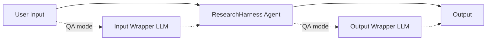

# ResearchHarness Tutorial

This tutorial explains how to use ResearchHarness from the command line and as
an OpenAI-compatible API service.

ResearchHarness is a lightweight, general-purpose harness for tool-using LLM
agents. It can be used as:

- a command-line local agent,
- a fair execution substrate for agent benchmarks,
- an OpenAI-compatible synchronous API backend,
- a personal assistant runtime for files, code, reports, PDFs, images, and web tasks.

## Project Structure

If you are reading the repository for the first time, start with these paths.

### Core runtime

- [run_agent.py](../run_agent.py): thin command-line entrypoint for direct agent runs.
- [run_frontend.py](../run_frontend.py): one-command launcher for the local browser UI.
- [run_server.py](../run_server.py): OpenAI-compatible API server entrypoint.
- [api/openai_server.py](../api/openai_server.py): `/v1/chat/completions` request handling, wrappers, and per-request run directories.
- [frontend/](../frontend): local WebSocket UI, static assets, and browser AskUser bridge.
- [agent_base/react_agent.py](../agent_base/react_agent.py): main ReAct loop, model calls, tool-call handling, trace/session state integration.
- [agent_base/base.py](../agent_base/base.py): base agent hooks for extension and benchmark adapters.
- [agent_base/prompt.py](../agent_base/prompt.py): base system prompt composition.
- [agent_base/trace_utils.py](../agent_base/trace_utils.py): flat JSONL trace writer.
- [agent_base/console_utils.py](../agent_base/console_utils.py): readable CLI event printing.

### Tools

- [agent_base/tools/tool_file.py](../agent_base/tools/tool_file.py): file, PDF, and image tools.
- [agent_base/tools/tool_runtime.py](../agent_base/tools/tool_runtime.py): Bash and persistent terminal tools.
- [agent_base/tools/tool_web.py](../agent_base/tools/tool_web.py): web search, scholar search, and webpage fetching.
- [agent_base/tools/README.md](../agent_base/tools/README.md): detailed tool documentation.

### Benchmark and API adapters

- [benchmarks/README.md](../benchmarks/README.md): benchmark adapter overview.
- [benchmarks/](../benchmarks): benchmark-specific role prompts and adapters.
- [benchmarks/QA/README.md](../benchmarks/QA/README.md): QA/VQA OpenAI-compatible API usage.

### Docs and tests

- [docs/tutorial_en.md](tutorial_en.md): this English tutorial.
- [docs/tutorial_zh.md](tutorial_zh.md): Chinese tutorial.
- [tests/](../tests): tool checks and end-to-end agent tests.
- [tests/example_files/](../tests/example_files): fixed local fixtures.

### Runtime roots

- [workspace/](../workspace): default local CLI workspace root.
- [api_runs/](../api_runs): default API deployment run root.
- [traces/](../traces): default CLI trace output root.

Only the `.gitkeep` files in these runtime roots are tracked. Generated files
inside them are ignored.

## 1. Install

Clone the repository and install dependencies:

```bash
python3 -m pip install -r requirements.txt
```

Python 3.10+ is recommended.

## 2. Configure Environment Variables

Copy `.env.example` to `.env` and fill in the required values.

Required variables:

| Variable | Meaning |
| --- | --- |
| `API_KEY` | API key for your OpenAI-compatible LLM provider. |
| `API_BASE` | Base URL for the OpenAI-compatible chat-completions endpoint. |
| `MODEL_NAME` | Main model used by ResearchHarness. |
| `SERPER_KEY` | Serper key for `WebSearch` and `ScholarSearch`: https://serper.dev/ |
| `JINA_KEY` | Jina key for `WebFetch`: https://jina.ai/ |
| `MINERU_TOKEN` | MinerU token for `ReadPDF`: https://mineru.net/ |

Optional variables:

| Variable | Default | Meaning |
| --- | --- | --- |
| `WORKSPACE_ROOT` | `./workspace` | Default workspace root when no explicit workspace is passed. |
| `MAX_LLM_CALL_PER_RUN` | `100` | Maximum LLM calls in one agent run. |
| `MAX_AGENT_ROUNDS` | `100` | Maximum ReAct loop rounds. |
| `MAX_AGENT_RUNTIME_SECONDS` | `9000` | Maximum wall-clock runtime for one agent run. |
| `LLM_TIMEOUT_SECONDS` | `600` | Timeout for each LLM API request. |
| `WEBFETCH_TIMEOUT_SECONDS` | `180` | Overall timeout for one WebFetch tool call. |
| `WEBFETCH_MAX_CHARS` | `30000` | Hard maximum characters returned by one WebFetch call. |
| `LLM_MAX_OUTPUT_TOKENS` | `10000` | Requested maximum output tokens. |
| `MAX_INPUT_TOKENS` | `320000` | Input-token budget used by runtime accounting. |
| `LLM_MAX_RETRIES` | `10` | Maximum retries for transient LLM API errors. |
| `TEMPERATURE` | `0.6` | Main model temperature. |
| `TOP_P` | `0.95` | Main model top-p. |
| `PRESENCE_PENALTY` | `1.1` | Main model presence penalty when supported. |
| `AUTO_COMPACT_TRIGGER_TOKENS` | `128k` | Context length threshold for automatic compaction. |
| `IMAGE_PART_TOKEN_ESTIMATE` | `1536` | Token estimate for each image content part. |
| `LLM_IMAGE_MAX_EDGE` | `1568` | Maximum image edge sent to multimodal models. |
| `LLM_IMAGE_MAX_BYTES` | `524288` | Maximum compressed image payload size. |
| `LLM_IMAGE_JPEG_QUALITY` | `85` | Initial JPEG quality for image compression. |
| `DEBUG_AGENT` | `false` | Verbose agent-loop logs. |
| `DEBUG_SEARCH` | `false` | Verbose WebSearch logs. |
| `DEBUG_SCHOLAR` | `false` | Verbose ScholarSearch logs. |
| `DEBUG_VISIT` | `false` | Verbose WebFetch logs. |

Before real use, run:

```bash
python3 tests/test_tool_availability.py
```

All tools should pass. Missing service keys, missing dependencies, exhausted
credits, or unavailable external tools should be treated as failures.

If `WebSearch`, `ScholarSearch`, `WebFetch`, or `ReadPDF` fails with network,
TLS, upload, download, or parsing errors, try disabling VPN/proxy and rerun the
test.

## 3. Command-Line Usage

Run a simple prompt:

```bash
python3 run_agent.py "Who proposed the transformer architecture, and in what year was the paper published?"
```

Use an explicit workspace:

```bash
python3 run_agent.py "Summarize this project." \
  --workspace-root ./workspace
```

You can replace `./workspace` with any other workspace directory.

Save traces to a directory:

```bash
python3 run_agent.py "Summarize this project." \
  --workspace-root ./workspace \
  --trace-dir ./traces
```

You can replace `./traces` with any other trace directory. Keep it separate from
the agent workspace; do not point `--trace-dir` at the same folder used by
`--workspace-root`.

Without `--trace-dir`, CLI runs do not write a trace file.

Append a role prompt:

```bash
python3 run_agent.py "Answer this QA task." \
  --workspace-root ./workspace \
  --role-prompt-file benchmarks/QA/role_prompt.md
```

Attach a local image:

```bash
python3 run_agent.py "Read the image and return JSON." \
  --workspace-root ./workspace \
  --images /path/to/image.png /path/to/second-image.png
```

Each image path must exist. RH copies images into `./workspace/inputs/images/`,
sends them as initial `image_url` content parts, and adds each saved relative
path to the user text so later rounds can call `ReadImage` on the same files.

In an interactive terminal, CLI runs continue after a final answer and prompt
for a follow-up. The follow-up run keeps the prior messages, tool results, and
saved image path hints. During a running step, `Ctrl+C` interrupts the current
run at the next safe point and returns to follow-up mode with context preserved.
Press `Ctrl+C` at the follow-up prompt or send EOF to exit. Use `--no-chat` for
strict one-shot behavior, or `--chat` to force follow-up mode.

For browser-based local use, run `python3 run_frontend.py`. The frontend uses an
existing workspace selected in the page, streams tool steps live, accepts one or
more image attachments, and continues the current conversation after each final
answer until you click **New chat**. While running, the send button becomes
**Stop**; it interrupts at the next safe point and keeps the conversation
context for the next message. The model dropdown is local to each run; changing
it affects the next run only and does not mutate `.env` or other sessions.

### CLI Parameters

| Parameter | Required | Meaning |
| --- | --- | --- |
| positional `prompt` | yes, unless `--prompt-file` is used | Prompt text. |
| `--prompt-file PATH` | no | Read prompt text from a UTF-8 file. |
| `--workspace-root PATH` | no | Workspace root for local file tools, Bash, and terminal sessions. Created if missing. |
| `--trace-dir PATH` | no | Directory where `trace_*.jsonl` is written. |
| `--role-prompt-file PATH` | no, repeatable | Append role-specific prompt text to the base system prompt. |
| `--images PATH [PATH ...]` | no | Copy one or more local images into `inputs/images/` and attach them to the initial user message. |
| `--chat` / `--no-chat` | no | Enable or disable CLI follow-up mode. Default: enabled only when stdin and stdout are interactive terminals. |
| `--extra-tool NAME` | no, repeatable | Enable an optional compatibility tool such as `str_replace_editor`. Optional tools are not loaded by default. |

## 4. OpenAI-Compatible API Server

ResearchHarness can serve a synchronous OpenAI-compatible endpoint:

```http
POST /v1/chat/completions
```

This allows existing OpenAI SDK clients to call ResearchHarness by changing only
`base_url`.

### Start the Server

Default deployment:

```bash
python3 run_server.py \
  --api-runs-dir ./api_runs \
  --host 127.0.0.1 \
  --port 8686
```

Recommended QA/VQA benchmark deployment with a benchmark role overlay and wrappers:

```bash
python3 run_server.py \
  --api-runs-dir ./api_runs \
  --host 127.0.0.1 \
  --port 8686 \
  --role-prompt-file benchmarks/QA/role_prompt.md \
  --input-wrapper \
  --output-wrapper
```

### API Server Parameters

| Parameter | Required | Default | Meaning |
| --- | --- | --- | --- |
| `--api-runs-dir PATH` | yes | none | Parent directory for API runs. Each request gets one subdirectory. |
| `--host HOST` | no | `127.0.0.1` | Host to bind. |
| `--port PORT` | no | `8686` | Port to bind. |
| `--role-prompt-file PATH` | no, repeatable | none | Append role prompt text to the base ResearchHarness prompt. |
| `--input-wrapper` / `--no-input-wrapper` | no | disabled | Enable or disable the input LLM wrapper. |
| `--output-wrapper` / `--no-output-wrapper` | no | disabled | Enable or disable the output LLM wrapper. |
| `--max-concurrent-runs N` | no | `32` | Maximum concurrent agent runs handled by this server process. Raise it when local resources and backend API quota allow higher throughput. |
| `--extra-tool NAME` | no, repeatable | none | Enable an optional compatibility tool for every API run, for example `str_replace_editor`. |

### Wrapper Modes

Both wrappers are disabled by default. The recommended modes are default
transparent agent deployment and QA/VQA benchmark deployment.

QA/VQA benchmark mode:

```bash
python3 run_server.py \
  --api-runs-dir ./api_runs \
  --host 127.0.0.1 \
  --port 8686 \
  --role-prompt-file benchmarks/QA/role_prompt.md \
  --input-wrapper \
  --output-wrapper
```

Default transparent agent mode:

```bash
python3 run_server.py \
  --api-runs-dir ./api_runs \
  --host 127.0.0.1 \
  --port 8686
```

The input wrapper rewrites the original user request into a stable task for the
agent. The output wrapper formats the agent result to match the user's requested
answer contract. Wrappers must not invent new facts; they only normalize input
and format output. Advanced deployments can still combine `--role-prompt-file`,
`--input-wrapper`, and `--output-wrapper` manually.

### API Concurrency

The endpoint is synchronous for the caller, but each long agent run is executed
in a server-side thread pool. This prevents one slow `/v1/chat/completions`
request from blocking the FastAPI event loop and serializing all other
requests.

`--max-concurrent-runs` controls the number of simultaneous agent runs in this
server process. Requests above the limit wait asynchronously for a free slot.
For large benchmark batches, raise the value according to local CPU, memory,
disk, network, and backend API quota:

```bash
python3 run_server.py \
  --api-runs-dir ./api_runs \
  --host 127.0.0.1 \
  --port 8686 \
  --max-concurrent-runs 128
```

### API Model Selection

The OpenAI-compatible `model` field is a ResearchHarness routing label, not a
provider selector. Use `RH` or omit `model` to run the default backend model
from `MODEL_NAME`. To override the backend model for one request, use the exact
two-hyphen prefix form `RH--<llm-model-name>`, for example `RH--gpt-5.5` or
`RH--claude-opus-4-7`.

Direct model names such as `gpt-5.5` are rejected. The override is local to that
API request; it does not mutate environment variables and does not affect other
concurrent requests. The agent run, enabled wrappers, and compaction all use the
same selected backend model.

The API server is intentionally one request -> one answer. It does not keep a
server-side conversation between HTTP requests. If an application needs API
multi-turn behavior, keep that state in the client and send the needed prior
context in later requests.



## 5. API Workspace Layout

By default, when a request does not provide a valid `workspace-root`, each API
request creates one run directory with an agent-visible workspace and an
independent trace directory:

```text
./api_runs/
└── run_YYYYMMDD_HHMMSS_<random>/
    ├── agent_workspace/          # visible to the agent
    │   └── inputs/
    │       └── images/           # user-provided images, when present
    └── agent_trace/              # server-side trace and session state
        ├── api_trace.jsonl
        ├── trace_*.jsonl
        └── _session_state.json
```

Meaning:

| Path | Meaning |
| --- | --- |
| `run_YYYYMMDD_HHMMSS_<random>/` | Per-request run root. |
| `agent_workspace/` | The only workspace visible to the agent. File tools, Bash, `ls`, and `cat` start here. |
| `agent_workspace/inputs/images/` | User-provided images saved from API requests. |
| `agent_trace/` | API trace, agent trace, and runtime records. |

If a request provides `workspace-root` with an absolute path to an existing
directory, the agent uses that directory instead of the default
`agent_workspace/`. If the field is missing, relative, or not an existing
directory, the request falls back to the default `agent_workspace/`. Use exactly
`workspace-root`; synonymous spellings such as `workspace_root` are rejected to
avoid silent routing mistakes.

The per-request `agent_trace/` directory is always created under
`--api-runs-dir`, even when a custom `workspace-root` is used. For custom
workspaces, uploaded images are saved inside that workspace under
`inputs/images/<run_id>/`.

For multimodal requests, image inputs are handled in two ways at the same time:
the image content is passed to the backend model as initial multimodal input
when the selected model supports it, and each image is saved inside the selected
workspace. Each saved relative path is also included in the agent-visible text,
so later rounds can call `ReadImage` on a stable local path without repeatedly
resending image bytes.

This separation keeps user-visible tool work separate from server-side trace files.
In API deployment mode, traces are saved by default: every request writes
`api_trace.jsonl`, `trace_*.jsonl`, and `_session_state.json` under that run's `agent_trace/`
directory.

## 6. Text Request with OpenAI SDK

```python
from openai import OpenAI

client = OpenAI(api_key="unused", base_url="http://127.0.0.1:8686/v1")

response = client.chat.completions.create(
    model="RH",
    messages=[
        {"role": "user", "content": "Answer in one sentence: what is 2 + 2?"}
    ],
)

print(response.choices[0].message.content)
```

## 7. Multimodal Request with OpenAI SDK

The first API version supports one or more `data:image/...;base64,...` image
URLs in the same request. Remote image URLs and local file paths are
intentionally not supported by the API server.

The example below generates an image in memory and asks for JSON output.

```python
import base64
from io import BytesIO

from PIL import Image, ImageDraw
from openai import OpenAI

image = Image.new("RGB", (320, 120), "white")
draw = ImageDraw.Draw(image)
draw.text((40, 45), "7 + 5 = ?", fill="black")
buffer = BytesIO()
image.save(buffer, format="PNG")
data_url = "data:image/png;base64," + base64.b64encode(buffer.getvalue()).decode("ascii")

client = OpenAI(api_key="unused", base_url="http://127.0.0.1:8686/v1")

response = client.chat.completions.create(
    model="RH--gpt-5.5",
    messages=[
        {
            "role": "user",
            "content": [
                {
                    "type": "text",
                    "text": (
                        "The image contains a simple arithmetic expression. "
                        "Return JSON with exactly two keys: expression and answer."
                    ),
                },
                {"type": "image_url", "image_url": {"url": data_url}},
            ],
        }
    ],
)

print(response.choices[0].message.content)
```

Expected answer shape:

```json
{"expression":"7 + 5","answer":12}
```

## 8. API Request and Response Contract

Model routing follows a compact ResearchHarness label convention. Use `RH` or
omit `model` to run the default backend `MODEL_NAME`. Use
`RH--<llm-model-name>` with exactly two hyphens for a per-request override, for
example `RH--gpt-5.5` or `RH--claude-opus-4-7`. The selected backend model is
used consistently by enabled wrappers, the agent loop, and compaction for that
request only.

### `POST /v1/chat/completions`

Supported request fields:

| Field | Required | Meaning |
| --- | --- | --- |
| `model` | no | Use `RH` or omit it for the default `MODEL_NAME`. Use `RH--<llm-model-name>` with exactly two hyphens for a per-request backend override. Direct model names such as `gpt-5.5` are rejected. |
| `messages` | yes | OpenAI-style chat messages. |
| `stream` | no | Must be absent or `false`; streaming is not supported. |
| `n` | no | Must be absent or `1`. |
| `max_tokens` | no | Maximum output tokens for the output wrapper. |
| `max_completion_tokens` | no | Alias accepted for output-wrapper max tokens. |
| `response_format` | no | Passed to the wrappers as an output-format hint. |
| `workspace-root` | no | Absolute path to an existing workspace directory for this request. If missing or invalid, the default per-request `agent_workspace/` is used. |

Supported message roles:

| Role | Supported |
| --- | --- |
| `system` | yes |
| `user` | yes |
| `assistant` | yes |
| `tool` | no |

Supported content forms:

```json
{"role": "user", "content": "plain text"}
```

```json
{
  "role": "user",
  "content": [
    {"type": "text", "text": "question"},
    {"type": "image_url", "image_url": {"url": "data:image/png;base64,..."}}
  ]
}
```

Response shape:

```json
{
  "id": "chatcmpl_...",
  "object": "chat.completion",
  "created": 1770000000,
  "model": "RH",
  "choices": [
    {
      "index": 0,
      "message": {
        "role": "assistant",
        "content": "final answer"
      },
      "finish_reason": "stop"
    }
  ]
}
```

Callers usually only need:

```python
response.choices[0].message.content
```

### `GET /v1/health`

Returns:

```json
{
  "status": "ok",
  "api_runs_dir": "./api_runs",
  "input_wrapper": false,
  "output_wrapper": false,
  "max_concurrent_runs": 32,
  "extra_tools": []
}
```

## 9. Tool Surface

ResearchHarness currently includes:

| Tool | Purpose |
| --- | --- |
| `Glob` | Discover files by pattern. |
| `Grep` | Search text in files. |
| `Read` | Read text files with bounds. |
| `ReadPDF` | Parse PDFs with MinerU/structai. |
| `ReadImage` | Inspect local image files and forward image content to vision-capable models. |
| `Write` | Write files inside the workspace. |
| `Edit` | Patch files inside the workspace. |
| `Bash` | Run shell commands inside the workspace. |
| `WebSearch` | Web search through Serper. |
| `ScholarSearch` | Scholar-style search through Serper. |
| `WebFetch` | Fetch cleaned, range-bounded webpage text through Jina from a URL, with optional `start_line`, `end_line`, and `max_chars` controls. |
| `AskUser` | Ask a human for clarification in interactive runs. Disabled by some benchmark adapters. |
| `TerminalStart` / `TerminalWrite` / `TerminalRead` / `TerminalInterrupt` / `TerminalKill` | Persistent terminal sessions. |

## 10. Traces and Records

CLI runs write traces only when `--trace-dir` is provided. Without
`--trace-dir`, CLI runs do not write a trace file.

For CLI and frontend runs, keep trace files outside the agent-visible workspace.
This prevents the agent from inspecting its own trace/session state and keeps
benchmark-style workspaces clean.

API runs write traces under:

```text
./api_runs/run_.../agent_trace/
```

Important files:

| File | Meaning |
| --- | --- |
| `api_trace.jsonl` | API events, agent result records, and enabled wrapper records. |
| `trace_*.jsonl` | Flat agent runtime trace. |
| `_session_state.json` | Current session state, written next to `trace_*.jsonl` when tracing is enabled. |

The trace stores tool calls, tool results, LLM call capture payloads, compaction
events, errors, and final termination state.

## 11. Benchmark Adapters

Tracked benchmark contracts live under `benchmarks/`.

Current tracked adapters:

| Benchmark | Directory | Notes |
| --- | --- | --- |
| ResearchClawBench | `benchmarks/ResearchClawBench/` | CLI integration with role prompt and adapter. |
| QA / VQA | `benchmarks/QA/` | OpenAI-compatible API integration for text and multimodal QA. |

Benchmark-specific behavior should stay outside `agent_base/`.

## 12. Testing

Recommended checks:

```bash
python3 tests/test_tool_availability.py
python3 tests/test_openai_api_checks.py
python3 tests/test_agent_extension_checks.py
python3 tests/test_edge_case_checks.py
python3 tests/test_extra_tools.py
python3 tests/test_toolchain_validation.py
```

If using conda:

```bash
/home/xwh/miniconda3/bin/conda run -n agent python3 tests/test_openai_api_checks.py
```

## 13. Troubleshooting

Common issues:

| Symptom | Likely cause | Action |
| --- | --- | --- |
| Missing required env error | `.env` is incomplete | Fill required variables. |
| Web/PDF tools fail | VPN/proxy/TLS/service issue | Disable VPN/proxy and rerun tool availability tests. |
| Image request returns 400 | Image URL is not a `data:image/...;base64,...` URL | Convert the image to a base64 data URL. |
| Backend model rejects images | Model endpoint is not vision-capable | Use a vision-capable model or send text-only tasks. |
| API request fails with streaming error | `stream=true` was sent | Use synchronous requests only. |
| Unexpected output format | Output wrapper disabled or prompt under-specified | Enable `--output-wrapper` and state the desired format clearly. |

## 14. Current Boundaries

The first API version intentionally does not include:

- streaming,
- async run status,
- cancellation,
- artifact download endpoints,
- remote image URL downloading,
- user authentication,
- multi-tenant access control.

These can be added later as separate layers without changing the core harness
loop.
