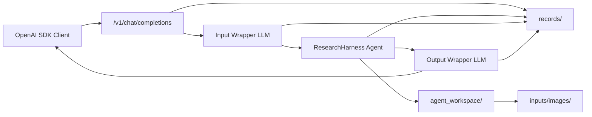

# ResearchHarness Tutorial

This tutorial explains how to use ResearchHarness from the command line and as
an OpenAI-compatible API service.

ResearchHarness is a lightweight, general-purpose harness for tool-using LLM
agents. It can be used as:

- a command-line local agent,
- a fair execution substrate for agent benchmarks,
- an OpenAI-compatible synchronous API backend,
- a personal assistant runtime for files, code, reports, PDFs, images, and web tasks.

## 1. Install

Clone the repository and install dependencies:

```bash
python3 -m pip install -r requirements.txt
```

Python 3.10+ is recommended.

## 2. Configure Environment Variables

Copy `.env.example` to `.env` and fill in the required values.

Required variables:

| Variable | Meaning |
| --- | --- |
| `API_KEY` | API key for your OpenAI-compatible LLM provider. |
| `API_BASE` | Base URL for the OpenAI-compatible chat-completions endpoint. |
| `MODEL_NAME` | Main model used by ResearchHarness. |
| `SERPER_KEY_ID` | Serper key for `WebSearch` and `ScholarSearch`: https://serper.dev/ |
| `JINA_API_KEYS` | Jina key for `WebFetch`: https://jina.ai/ |
| `MINERU_TOKEN` | MinerU token for `ReadPDF`: https://mineru.net/ |

Optional variables:

| Variable | Default | Meaning |
| --- | --- | --- |
| `WORKSPACE_ROOT` | `./workspace` | Default workspace root when no explicit workspace is passed. |
| `MAX_LLM_CALL_PER_RUN` | `100` | Maximum LLM calls in one agent run. |
| `MAX_AGENT_ROUNDS` | `100` | Maximum ReAct loop rounds. |
| `MAX_AGENT_RUNTIME_SECONDS` | `9000` | Maximum wall-clock runtime for one agent run. |
| `LLM_TIMEOUT_SECONDS` | `600` | Timeout for each LLM API request. |
| `LLM_MAX_OUTPUT_TOKENS` | `10000` | Requested maximum output tokens. |
| `MAX_INPUT_TOKENS` | `320000` | Input-token budget used by runtime accounting. |
| `LLM_MAX_RETRIES` | `10` | Maximum retries for transient LLM API errors. |
| `TEMPERATURE` | `0.6` | Main model temperature. |
| `TOP_P` | `0.95` | Main model top-p. |
| `PRESENCE_PENALTY` | `1.1` | Main model presence penalty when supported. |
| `AUTO_COMPACT_TRIGGER_TOKENS` | `128k` | Context length threshold for automatic compaction. |
| `IMAGE_PART_TOKEN_ESTIMATE` | `1536` | Token estimate for each image content part. |
| `LLM_IMAGE_MAX_EDGE` | `1568` | Maximum image edge sent to multimodal models. |
| `LLM_IMAGE_MAX_BYTES` | `524288` | Maximum compressed image payload size. |
| `LLM_IMAGE_JPEG_QUALITY` | `85` | Initial JPEG quality for image compression. |
| `DEBUG_AGENT` | `false` | Verbose agent-loop logs. |
| `DEBUG_SEARCH` | `false` | Verbose WebSearch logs. |
| `DEBUG_SCHOLAR` | `false` | Verbose ScholarSearch logs. |
| `DEBUG_VISIT` | `false` | Verbose WebFetch logs. |

Before real use, run:

```bash
python3 tests/test_tool_availability.py
```

All tools should pass. Missing service keys, missing dependencies, exhausted
credits, or unavailable external tools should be treated as failures.

If `WebSearch`, `ScholarSearch`, `WebFetch`, or `ReadPDF` fails with network,
TLS, upload, download, or parsing errors, try disabling VPN/proxy and rerun the
test.

## 3. Command-Line Usage

Run a simple prompt:

```bash
python3 run_agent.py "Who proposed the transformer architecture, and in what year was the paper published?"
```

Use an explicit workspace:

```bash
python3 run_agent.py "Summarize this project." \
  --workspace-root ./workspace
```

You can replace `./workspace` with any other workspace directory.

Save traces to a directory:

```bash
python3 run_agent.py "Summarize this project." \
  --workspace-root ./workspace \
  --trace-dir ./traces
```

You can replace `./traces` with any other trace directory.

Without `--trace-dir`, CLI runs do not write a trace file.

Append a role prompt:

```bash
python3 run_agent.py "Answer this QA task." \
  --workspace-root ./workspace \
  --role-prompt-file benchmarks/QA/role_prompt.md
```

### CLI Parameters

| Parameter | Required | Meaning |
| --- | --- | --- |
| positional `prompt` | yes, unless `--prompt-file` is used | Prompt text. |
| `--prompt-file PATH` | no | Read prompt text from a UTF-8 file. |
| `--workspace-root PATH` | no | Workspace root for local file tools, Bash, and terminal sessions. Created if missing. |
| `--trace-dir PATH` | no | Directory where `trace_*.jsonl` is written. |
| `--role-prompt-file PATH` | no, repeatable | Append role-specific prompt text to the base system prompt. |

## 4. OpenAI-Compatible API Server

ResearchHarness can serve a synchronous OpenAI-compatible endpoint:

```http
POST /v1/chat/completions
```

This allows existing OpenAI SDK clients to call ResearchHarness by changing only
`base_url`.

### Start the Server

Default deployment:

```bash
python3 serve_openai.py \
  --workspace-root ./workspace/api_runs \
  --host 127.0.0.1 \
  --port 8000
```

QA/VQA benchmark deployment with a role prompt:

```bash
python3 serve_openai.py \
  --workspace-root ./workspace/api_runs \
  --host 127.0.0.1 \
  --port 8000 \
  --role-prompt-file benchmarks/QA/role_prompt.md
```

### API Server Parameters

| Parameter | Required | Default | Meaning |
| --- | --- | --- | --- |
| `--workspace-root PATH` | yes | none | Parent directory for API runs. Each request gets one subdirectory. |
| `--host HOST` | no | `127.0.0.1` | Host to bind. |
| `--port PORT` | no | `8000` | Port to bind. |
| `--role-prompt-file PATH` | no, repeatable | none | Append role prompt text to the base ResearchHarness prompt. |
| `--input-wrapper` / `--no-input-wrapper` | no | enabled | Enable or disable the input LLM wrapper. |
| `--output-wrapper` / `--no-output-wrapper` | no | enabled | Enable or disable the output LLM wrapper. |

### Wrapper Modes

Both wrappers are enabled by default.

Strict-format benchmark mode:

```bash
python3 serve_openai.py \
  --workspace-root ./workspace/api_runs \
  --role-prompt-file benchmarks/QA/role_prompt.md \
  --input-wrapper \
  --output-wrapper
```

Direct agent mode:

```bash
python3 serve_openai.py \
  --workspace-root ./workspace/api_runs \
  --no-input-wrapper \
  --no-output-wrapper
```

Simple input plus strict final formatting:

```bash
python3 serve_openai.py \
  --workspace-root ./workspace/api_runs \
  --no-input-wrapper \
  --output-wrapper
```

The input wrapper rewrites the original user request into a stable task for the
agent. The output wrapper formats the agent result to match the user's requested
answer contract. Wrappers must not invent new facts; they only normalize input
and format output.



## 5. API Workspace Layout

Each API request creates one run directory:

```text
./workspace/api_runs/
  run_YYYYMMDD_HHMMSS_<random>/
    agent_workspace/
      inputs/images/
    records/
```

Meaning:

| Path | Meaning |
| --- | --- |
| `run_YYYYMMDD_HHMMSS_<random>/` | Per-request run root. |
| `agent_workspace/` | The only workspace visible to the agent. File tools, Bash, `ls`, and `cat` start here. |
| `agent_workspace/inputs/images/` | User-provided images saved from API requests. |
| `records/` | API trace, agent trace, and runtime records. |

This separation keeps user-visible tool work separate from server-side records.
In API deployment mode, traces are saved by default: every request writes
`api_trace.jsonl` and `trace_*.jsonl` records under that run's `records/`
directory.

## 6. Text Request with OpenAI SDK

```python
from openai import OpenAI

client = OpenAI(api_key="unused", base_url="http://127.0.0.1:8000/v1")

response = client.chat.completions.create(
    model="researchharness",
    messages=[
        {"role": "user", "content": "Answer in one sentence: what is 2 + 2?"}
    ],
)

print(response.choices[0].message.content)
```

## 7. Multimodal Request with OpenAI SDK

The first API version supports `data:image/...;base64,...` image URLs. Remote
image URLs and local file paths are intentionally not supported by the API
server.

The example below generates an image in memory and asks for JSON output.

```python
import base64
from io import BytesIO

from PIL import Image, ImageDraw
from openai import OpenAI

image = Image.new("RGB", (320, 120), "white")
draw = ImageDraw.Draw(image)
draw.text((40, 45), "7 + 5 = ?", fill="black")
buffer = BytesIO()
image.save(buffer, format="PNG")
data_url = "data:image/png;base64," + base64.b64encode(buffer.getvalue()).decode("ascii")

client = OpenAI(api_key="unused", base_url="http://127.0.0.1:8000/v1")

response = client.chat.completions.create(
    model="researchharness",
    messages=[
        {
            "role": "user",
            "content": [
                {
                    "type": "text",
                    "text": (
                        "The image contains a simple arithmetic expression. "
                        "Return JSON with exactly two keys: expression and answer."
                    ),
                },
                {"type": "image_url", "image_url": {"url": data_url}},
            ],
        }
    ],
)

print(response.choices[0].message.content)
```

Expected answer shape:

```json
{"expression":"7 + 5","answer":12}
```

## 8. API Request and Response Contract

### `POST /v1/chat/completions`

Supported request fields:

| Field | Required | Meaning |
| --- | --- | --- |
| `model` | yes | Client-visible model label. It does not override `MODEL_NAME`; the backend model comes from `.env`. |
| `messages` | yes | OpenAI-style chat messages. |
| `stream` | no | Must be absent or `false`; streaming is not supported. |
| `n` | no | Must be absent or `1`. |
| `max_tokens` | no | Maximum output tokens for the output wrapper. |
| `max_completion_tokens` | no | Alias accepted for output-wrapper max tokens. |
| `response_format` | no | Passed to the wrappers as an output-format hint. |

Supported message roles:

| Role | Supported |
| --- | --- |
| `system` | yes |
| `user` | yes |
| `assistant` | yes |
| `tool` | no |

Supported content forms:

```json
{"role": "user", "content": "plain text"}
```

```json
{
  "role": "user",
  "content": [
    {"type": "text", "text": "question"},
    {"type": "image_url", "image_url": {"url": "data:image/png;base64,..."}}
  ]
}
```

Response shape:

```json
{
  "id": "chatcmpl_...",
  "object": "chat.completion",
  "created": 1770000000,
  "model": "researchharness",
  "choices": [
    {
      "index": 0,
      "message": {
        "role": "assistant",
        "content": "final answer"
      },
      "finish_reason": "stop"
    }
  ]
}
```

Callers usually only need:

```python
response.choices[0].message.content
```

### `GET /v1/health`

Returns:

```json
{
  "status": "ok",
  "workspace_root": "./workspace/api_runs",
  "input_wrapper": true,
  "output_wrapper": true
}
```

## 9. Tool Surface

ResearchHarness currently includes:

| Tool | Purpose |
| --- | --- |
| `Glob` | Discover files by pattern. |
| `Grep` | Search text in files. |
| `Read` | Read text files with bounds. |
| `ReadPDF` | Parse PDFs with MinerU/structai. |
| `ReadImage` | Inspect local image files and forward image content to vision-capable models. |
| `Write` | Write files inside the workspace. |
| `Edit` | Patch files inside the workspace. |
| `Bash` | Run shell commands inside the workspace. |
| `WebSearch` | Web search through Serper. |
| `ScholarSearch` | Scholar-style search through Serper. |
| `WebFetch` | Fetch and summarize webpages through Jina and the configured model. |
| `AskUser` | Ask a human for clarification in interactive runs. Disabled by some benchmark adapters. |
| `TerminalStart` / `TerminalWrite` / `TerminalRead` / `TerminalInterrupt` / `TerminalKill` | Persistent terminal sessions. |

## 10. Traces and Records

CLI runs write traces only when `--trace-dir` is provided. Without
`--trace-dir`, CLI runs do not write a trace file.

API runs write records under:

```text
./workspace/api_runs/run_.../records/
```

Important files:

| File | Meaning |
| --- | --- |
| `api_trace.jsonl` | Input wrapper, agent result, and output wrapper records. |
| `trace_*.jsonl` | Flat agent runtime trace. |
| `_session_state.json` | Current session state, written inside the agent workspace. |

The trace stores tool calls, tool results, LLM call capture payloads, compaction
events, errors, and final termination state.

## 11. Benchmark Adapters

Tracked benchmark contracts live under `benchmarks/`.

Current tracked adapters:

| Benchmark | Directory | Notes |
| --- | --- | --- |
| ResearchClawBench | `benchmarks/ResearchClawBench/` | CLI integration with role prompt and adapter. |
| QA / VQA | `benchmarks/QA/` | OpenAI-compatible API integration for text and multimodal QA. |

Benchmark-specific behavior should stay outside `agent_base/`.

## 12. Testing

Recommended checks:

```bash
python3 tests/test_tool_availability.py
python3 tests/test_openai_api_checks.py
python3 tests/test_agent_extension_checks.py
python3 tests/test_edge_case_checks.py
python3 tests/test_toolchain_validation.py
```

If using conda:

```bash
/home/xwh/miniconda3/bin/conda run -n agent python3 tests/test_openai_api_checks.py
```

## 13. Troubleshooting

Common issues:

| Symptom | Likely cause | Action |
| --- | --- | --- |
| Missing required env error | `.env` is incomplete | Fill required variables. |
| Web/PDF tools fail | VPN/proxy/TLS/service issue | Disable VPN/proxy and rerun tool availability tests. |
| Image request returns 400 | Image URL is not a `data:image/...;base64,...` URL | Convert the image to a base64 data URL. |
| Backend model rejects images | Model endpoint is not vision-capable | Use a vision-capable model or send text-only tasks. |
| API request fails with streaming error | `stream=true` was sent | Use synchronous requests only. |
| Unexpected output format | Output wrapper disabled or prompt under-specified | Enable `--output-wrapper` and state the desired format clearly. |

## 14. Current Boundaries

The first API version intentionally does not include:

- streaming,
- async run status,
- cancellation,
- artifact download endpoints,
- remote image URL downloading,
- user authentication,
- multi-tenant access control.

These can be added later as separate layers without changing the core harness
loop.
