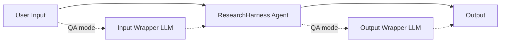

# ResearchHarness 教程

本文介绍如何通过命令行和 OpenAI-compatible API 使用 ResearchHarness。

ResearchHarness 是一个轻量、通用的 tool-using LLM agent harness。它可以作为：

- 命令行本地 agent，
- agent benchmark 的公平执行底座，
- OpenAI-compatible 同步 API 后端，
- 面向代码、文件、报告、PDF、图片、网页任务的个人助手运行时。

## 项目结构

第一次阅读仓库时，建议先从这些路径开始。

### 核心运行时

- [run_agent.py](../run_agent.py)：直接运行 agent 的轻量命令行入口。
- [run_frontend.py](../run_frontend.py)：本地浏览器 UI 的一键启动入口。
- [run_server.py](../run_server.py)：OpenAI-compatible API server 入口。
- [api/openai_server.py](../api/openai_server.py)：`/v1/chat/completions` 请求处理、wrapper 和每请求 run 目录。
- [frontend/](../frontend)：本地 WebSocket UI、静态资源和浏览器 AskUser bridge。
- [agent_base/react_agent.py](../agent_base/react_agent.py)：主 ReAct loop、模型调用、tool-call 处理、trace/session state 集成。
- [agent_base/base.py](../agent_base/base.py)：扩展和 benchmark adapter 使用的 base agent hooks。
- [agent_base/prompt.py](../agent_base/prompt.py)：base system prompt 组合。
- [agent_base/trace_utils.py](../agent_base/trace_utils.py)：flat JSONL trace writer。
- [agent_base/console_utils.py](../agent_base/console_utils.py)：可读的 CLI event 输出。

### 工具

- [agent_base/tools/tool_file.py](../agent_base/tools/tool_file.py)：文件、PDF、图片工具。
- [agent_base/tools/tool_runtime.py](../agent_base/tools/tool_runtime.py)：Bash 和持久 terminal 工具。
- [agent_base/tools/tool_web.py](../agent_base/tools/tool_web.py)：网页搜索、学术搜索和网页读取。
- [agent_base/tools/README.md](../agent_base/tools/README.md)：详细工具文档。

### Benchmark 和 API adapter

- [benchmarks/README.md](../benchmarks/README.md)：benchmark adapter 总览。
- [benchmarks/](../benchmarks)：benchmark-specific role prompts 和 adapters。
- [benchmarks/QA/README.md](../benchmarks/QA/README.md)：QA/VQA OpenAI-compatible API 用法。

### 文档和测试

- [docs/tutorial_en.md](tutorial_en.md)：英文教程。
- [docs/tutorial_zh.md](tutorial_zh.md)：当前中文教程。
- [tests/](../tests)：工具检查和端到端 agent 测试。
- [tests/example_files/](../tests/example_files)：固定本地测试 fixture。

### 运行产物目录

- [workspace/](../workspace)：默认本地 CLI workspace root。
- [api_runs/](../api_runs)：默认 API deployment run root。
- [traces/](../traces)：默认 CLI trace 输出目录。

这些运行产物目录中只有 `.gitkeep` 被追踪。运行产生的文件会被 git 忽略。

## 1. 安装

安装依赖：

```bash
python3 -m pip install -r requirements.txt
```

推荐使用 Python 3.10+。

## 2. 配置环境变量

复制 `.env.example` 为 `.env`，并填写必需变量。

必需变量：

| 变量 | 含义 |
| --- | --- |
| `API_KEY` | OpenAI-compatible LLM 服务的 API key。 |
| `API_BASE` | OpenAI-compatible chat-completions endpoint 的 base URL。 |
| `MODEL_NAME` | ResearchHarness 使用的主模型。 |
| `SERPER_KEY` | `WebSearch` 和 `ScholarSearch` 使用的 Serper key：https://serper.dev/ |
| `JINA_KEY` | `WebFetch` 使用的 Jina key：https://jina.ai/ |
| `MINERU_TOKEN` | `ReadPDF` 使用的 MinerU token：https://mineru.net/ |

可选变量：

| 变量 | 默认值 | 含义 |
| --- | --- | --- |
| `WORKSPACE_ROOT` | `./workspace` | 未显式传入 workspace 时使用的默认 workspace root。 |
| `MAX_LLM_CALL_PER_RUN` | `100` | 单次 agent run 最多允许的 LLM 调用次数。 |
| `MAX_AGENT_ROUNDS` | `100` | ReAct loop 最大轮次。 |
| `MAX_AGENT_RUNTIME_SECONDS` | `9000` | 单次 agent run 的最大运行秒数。 |
| `LLM_TIMEOUT_SECONDS` | `600` | 单次 LLM API 请求超时时间。 |
| `WEBFETCH_TIMEOUT_SECONDS` | `180` | 单次 WebFetch 工具调用的总超时时间。 |
| `WEBFETCH_MAX_CHARS` | `30000` | 单次 WebFetch 调用允许返回的硬上限字符数。 |
| `LLM_MAX_OUTPUT_TOKENS` | `10000` | 请求模型输出的最大 token 数。 |
| `MAX_INPUT_TOKENS` | `320000` | runtime token accounting 使用的输入 token 预算。 |
| `LLM_MAX_RETRIES` | `10` | 瞬时 LLM API 错误最大重试次数。 |
| `TEMPERATURE` | `0.6` | 主模型 temperature。 |
| `TOP_P` | `0.95` | 主模型 top-p。 |
| `PRESENCE_PENALTY` | `1.1` | provider 支持时使用的 presence penalty。 |
| `AUTO_COMPACT_TRIGGER_TOKENS` | `128k` | 自动上下文压缩触发阈值。 |
| `IMAGE_PART_TOKEN_ESTIMATE` | `1536` | 每个 image content part 的 token 估计。 |
| `LLM_IMAGE_MAX_EDGE` | `1568` | 发送给多模态模型的图片最大边长。 |
| `LLM_IMAGE_MAX_BYTES` | `524288` | 发送给多模态模型的压缩图片最大字节数。 |
| `LLM_IMAGE_JPEG_QUALITY` | `85` | 图片压缩时的初始 JPEG 质量。 |
| `DEBUG_AGENT` | `false` | 打印 agent loop 详细调试日志。 |
| `DEBUG_SEARCH` | `false` | 打印 WebSearch 调试日志。 |
| `DEBUG_SCHOLAR` | `false` | 打印 ScholarSearch 调试日志。 |
| `DEBUG_VISIT` | `false` | 打印 WebFetch 调试日志。 |

正式使用前，先运行：

```bash
python3 tests/test_tool_availability.py
```

预期结果是全部工具通过。缺 key、缺依赖、服务额度耗尽、外部工具不可用都应该视为失败，不应 skip。

如果 `WebSearch`、`ScholarSearch`、`WebFetch` 或 `ReadPDF` 出现 network、TLS、upload、download、PDF parsing 相关错误，优先尝试关闭 VPN / proxy 后重跑测试。

## 3. 命令行使用

直接运行一个 prompt：

```bash
python3 run_agent.py "Who proposed the transformer architecture, and in what year was the paper published?"
```

指定 workspace：

```bash
python3 run_agent.py "Summarize this project." \
  --workspace-root ./workspace
```

`./workspace` 可以替换为任何其他 workspace 目录。

保存 trace：

```bash
python3 run_agent.py "Summarize this project." \
  --workspace-root ./workspace \
  --trace-dir ./traces
```

`./traces` 可以替换为任何其他 trace 目录。建议让 trace 目录与 agent
workspace 分离，不要把 `--trace-dir` 指向和 `--workspace-root` 相同的文件夹。

如果不传 `--trace-dir`，CLI 运行不会写 trace 文件。

追加 role prompt：

```bash
python3 run_agent.py "Answer this QA task." \
  --workspace-root ./workspace \
  --role-prompt-file benchmarks/QA/role_prompt.md
```

附加本地图片：

```bash
python3 run_agent.py "Read the image and return JSON." \
  --workspace-root ./workspace \
  --images /path/to/image.png /path/to/second-image.png
```

每个图片路径都必须存在。RH 会把图片复制到 `./workspace/inputs/images/`，
作为初始 `image_url` content part 传给模型，同时把每个保存后的相对路径写进
用户文本，让后续轮次可以用 `ReadImage` 重新读取这些图片。

在交互式终端中，CLI 会在最终回答后继续等待 follow-up。下一轮会保留之前的
messages、工具结果和图片保存路径提示。运行过程中按 `Ctrl+C` 会在下一个安全点
中断当前 run，并带着上下文回到 follow-up 模式。在 follow-up 输入处按 `Ctrl+C`
或发送 EOF 可退出。脚本或 benchmark 如果需要严格的一问一答行为，使用
`--no-chat`；需要强制开启时使用 `--chat`。

如果需要浏览器本地界面，运行 `python3 run_frontend.py`。前端使用页面中选择的
已有 workspace，实时显示工具步骤，支持一张或多张图片附件，并在每次最终回答后
继续当前对话，直到点击 **New chat**。运行中发送按钮会变成 **Stop**；它会在下一个
安全点中断，并保留上下文用于下一条消息。模型下拉框只影响当前/下一次 run，
不会改写 `.env`，也不会影响其他请求或会话。

### CLI 参数

| 参数 | 是否必需 | 含义 |
| --- | --- | --- |
| 位置参数 `prompt` | 是，除非使用 `--prompt-file` | prompt 文本。 |
| `--prompt-file PATH` | 否 | 从 UTF-8 文件读取 prompt。 |
| `--workspace-root PATH` | 否 | 本地文件工具、Bash、Terminal 使用的 workspace root；不存在会自动创建。 |
| `--trace-dir PATH` | 否 | 写入 `trace_*.jsonl` 的目录。 |
| `--role-prompt-file PATH` | 否，可重复 | 追加 role-specific prompt 到 base system prompt。 |
| `--images PATH [PATH ...]` | 否 | 把一张或多张本地图片复制到 `inputs/images/` 并附加到初始用户消息。 |
| `--chat` / `--no-chat` | 否 | 开启或关闭 CLI follow-up 模式。默认只在 stdin 和 stdout 都是交互式终端时开启。 |
| `--extra-tool NAME` | 否，可重复 | 开启一个 optional compatibility tool，例如 `str_replace_editor`。默认不加载 optional tools。 |

## 4. OpenAI-Compatible API Server

ResearchHarness 可以部署为同步 OpenAI-compatible endpoint：

```http
POST /v1/chat/completions
```

这样，现有 OpenAI SDK 客户端只需要修改 `base_url` 就可以调用 ResearchHarness。

### 启动服务

默认部署：

```bash
python3 run_server.py \
  --api-runs-dir ./api_runs \
  --host 127.0.0.1 \
  --port 8686
```

推荐的 QA/VQA benchmark 部署，使用 benchmark role overlay 和 wrappers：

```bash
python3 run_server.py \
  --api-runs-dir ./api_runs \
  --host 127.0.0.1 \
  --port 8686 \
  --role-prompt-file benchmarks/QA/role_prompt.md \
  --input-wrapper \
  --output-wrapper
```

### API Server 参数

| 参数 | 是否必需 | 默认值 | 含义 |
| --- | --- | --- | --- |
| `--api-runs-dir PATH` | 是 | 无 | API runs 的父目录；每个请求会创建一个子目录。 |
| `--host HOST` | 否 | `127.0.0.1` | 服务监听 host。 |
| `--port PORT` | 否 | `8686` | 服务监听端口。 |
| `--role-prompt-file PATH` | 否，可重复 | 无 | 追加 role prompt 到 base ResearchHarness prompt。 |
| `--input-wrapper` / `--no-input-wrapper` | 否 | 关闭 | 开启或关闭输入 LLM wrapper。 |
| `--output-wrapper` / `--no-output-wrapper` | 否 | 关闭 | 开启或关闭输出 LLM wrapper。 |
| `--max-concurrent-runs N` | 否 | `32` | 当前 server 进程最多同时执行多少个 agent run。资源和后端 API quota 足够时可以调高。 |
| `--extra-tool NAME` | 否，可重复 | 无 | 为每个 API run 开启 optional compatibility tool，例如 `str_replace_editor`。 |

### Wrapper 模式

默认两个 wrapper 都关闭。推荐模式分为默认透明 agent 部署和 QA/VQA benchmark 部署。

QA/VQA benchmark 模式：

```bash
python3 run_server.py \
  --api-runs-dir ./api_runs \
  --host 127.0.0.1 \
  --port 8686 \
  --role-prompt-file benchmarks/QA/role_prompt.md \
  --input-wrapper \
  --output-wrapper
```

默认透明 agent 模式：

```bash
python3 run_server.py \
  --api-runs-dir ./api_runs \
  --host 127.0.0.1 \
  --port 8686
```

input wrapper 的作用是把原始用户请求整理为适合 agent 稳定执行的任务。output wrapper 的作用是把 agent 的最终结果整理为用户要求的答案格式。wrapper 不应该引入新事实，只做输入规范化和输出格式化。高级部署仍然可以手动组合 `--role-prompt-file`、`--input-wrapper` 和 `--output-wrapper`。

### API 并发

对调用方来说，endpoint 仍然是同步的一问一答接口。但每个长时间运行的 agent run
会进入 server 侧线程池执行，不再阻塞 FastAPI event loop，也不会因为一个慢请求而把
其他请求全部串行化。

`--max-concurrent-runs` 控制当前 server 进程最多同时执行多少个 agent run。超过该
限制的请求会异步等待空闲 run slot。大规模 benchmark 批量请求时，可以根据本地 CPU、
内存、磁盘、网络和后端 API quota 调高：

```bash
python3 run_server.py \
  --api-runs-dir ./api_runs \
  --host 127.0.0.1 \
  --port 8686 \
  --max-concurrent-runs 128
```

### API 模型选择

OpenAI-compatible 的 `model` 字段是 ResearchHarness 的模型路由 label，不是
provider selector。使用 `RH` 或不传 `model` 时，会运行 `MODEL_NAME` 指定的默认
底层模型。如果单个请求需要覆盖底层模型，使用精确的双 hyphen 前缀形式
`RH--<llm-model-name>`，例如 `RH--gpt-5.5` 或 `RH--claude-opus-4-7`。

直接传 `gpt-5.5` 这类裸模型名会被拒绝。这个覆盖只对当前 API 请求生效，不会修改
环境变量，也不会影响其他并发请求。agent run、已启用的 wrapper 和 compaction
都会使用同一个本次选择的底层模型。

API server 有意保持一问一答：每个 HTTP 请求创建一次隔离 run，并返回一个最终
assistant message。服务端不会跨请求保存 conversation state。如果应用需要 API
多轮对话，应由客户端保存状态，并在后续请求中传入需要的上下文。



## 5. API Workspace 结构

默认情况下，如果请求没有提供有效的 `workspace-root`，每个 API 请求都会创建一个
run 目录，里面包含 agent 可见 workspace 和独立 trace 目录：

```text
./api_runs/
└── run_YYYYMMDD_HHMMSS_<random>/
    ├── agent_workspace/          # agent 可见目录
    │   └── inputs/
    │       └── images/           # 用户提交的图片
    └── agent_trace/              # 服务端 trace 和 session state
        ├── api_trace.jsonl
        ├── trace_*.jsonl
        └── _session_state.json
```

含义：

| 路径 | 含义 |
| --- | --- |
| `run_YYYYMMDD_HHMMSS_<random>/` | 单个请求对应的 run 根目录。 |
| `agent_workspace/` | agent 唯一可见的 workspace；文件工具、Bash、`ls`、`cat` 都从这里开始。 |
| `agent_workspace/inputs/images/` | API 请求中用户提交的图片。 |
| `agent_trace/` | API trace、agent trace 和 runtime 记录。 |

如果请求中提供 `workspace-root`，并且它是一个指向已存在目录的绝对路径，
agent 会直接使用这个目录，而不是默认的 `agent_workspace/`。如果该字段缺失、
是相对路径，或不是已存在目录，本次请求会回退到默认的 `agent_workspace/`。
请求字段只能写成 `workspace-root`；`workspace_root` 等同义写法会被拒绝，
避免路径选择被静默忽略。

无论是否使用自定义 `workspace-root`，每个请求都会在 `--api-runs-dir` 下创建独立的
`agent_trace/`。因此 API trace、agent trace 和 `_session_state.json` 仍然统一回溯。
对于自定义 workspace，API 上传的图片会保存在该 workspace 的
`inputs/images/<run_id>/` 下。

对于多模态请求，每张图片会同时走两条路径：当底层模型支持多模态输入时，
图片内容会作为初始多模态输入直接传给模型；每张图片也会保存到本次选择的
workspace 中。每个保存后的相对路径也会写进 agent 可见文本，让后续轮次可以用
`ReadImage` 读取稳定的本地路径，而不是反复依赖内联图片字节。

这个结构把 agent 可见工作目录和服务端记录目录隔离开。
在 API 部署模式下，trace 默认保存：每个请求都会在自己的 `agent_trace/`
目录下写入 `api_trace.jsonl`、`trace_*.jsonl` 和 `_session_state.json`。

## 6. 纯文本 OpenAI SDK 请求

```python
from openai import OpenAI

client = OpenAI(api_key="unused", base_url="http://127.0.0.1:8686/v1")

response = client.chat.completions.create(
    model="RH",
    messages=[
        {"role": "user", "content": "Answer in one sentence: what is 2 + 2?"}
    ],
)

print(response.choices[0].message.content)
```

## 7. 多模态 OpenAI SDK 请求

第一版 API 支持同一个请求中包含一张或多张 `data:image/...;base64,...` 形式的图片 URL。API server 不支持远程图片 URL，也不支持让外部请求直接传本地文件路径。

下面的示例在代码中生成一张图片，并要求返回 JSON。

```python
import base64
from io import BytesIO

from PIL import Image, ImageDraw
from openai import OpenAI

image = Image.new("RGB", (320, 120), "white")
draw = ImageDraw.Draw(image)
draw.text((40, 45), "7 + 5 = ?", fill="black")
buffer = BytesIO()
image.save(buffer, format="PNG")
data_url = "data:image/png;base64," + base64.b64encode(buffer.getvalue()).decode("ascii")

client = OpenAI(api_key="unused", base_url="http://127.0.0.1:8686/v1")

response = client.chat.completions.create(
    model="RH--gpt-5.5",
    messages=[
        {
            "role": "user",
            "content": [
                {
                    "type": "text",
                    "text": (
                        "The image contains a simple arithmetic expression. "
                        "Return JSON with exactly two keys: expression and answer."
                    ),
                },
                {"type": "image_url", "image_url": {"url": data_url}},
            ],
        }
    ],
)

print(response.choices[0].message.content)
```

预期答案形状：

```json
{"expression":"7 + 5","answer":12}
```

## 8. API 请求与返回协议

模型路由使用简短的 ResearchHarness label 约定。使用 `RH` 或不传 `model` 时，
走默认的 `MODEL_NAME`。如果单个请求需要切换底层模型，使用
`RH--<llm-model-name>`，中间必须是两个 hyphen，例如 `RH--gpt-5.5` 或
`RH--claude-opus-4-7`。本次选择的底层模型会一致用于已启用的 wrapper、
agent loop 和 compaction，并且只对这个请求生效。

### `POST /v1/chat/completions`

支持的请求字段：

| 字段 | 是否必需 | 含义 |
| --- | --- | --- |
| `model` | 否 | 使用 `RH` 或不传时走默认 `MODEL_NAME`。单个请求需要切换底层模型时，必须使用 `RH--<llm-model-name>`，中间是两个 hyphen；直接传 `gpt-5.5` 这类模型名会被拒绝。 |
| `messages` | 是 | OpenAI-style chat messages。 |
| `stream` | 否 | 必须不存在或为 `false`；当前不支持 streaming。 |
| `n` | 否 | 必须不存在或为 `1`。 |
| `max_tokens` | 否 | output wrapper 最大输出 token。 |
| `max_completion_tokens` | 否 | output wrapper 最大输出 token 的兼容别名。 |
| `response_format` | 否 | 作为输出格式提示传给 wrapper。 |
| `workspace-root` | 否 | 本次请求使用的 workspace 绝对路径。只有指向已存在目录时才使用；缺失或无效时回退到默认 per-request `agent_workspace/`。 |

支持的 message role：

| Role | 是否支持 |
| --- | --- |
| `system` | 支持 |
| `user` | 支持 |
| `assistant` | 支持 |
| `tool` | 不支持 |

支持的 content 形式：

```json
{"role": "user", "content": "plain text"}
```

```json
{
  "role": "user",
  "content": [
    {"type": "text", "text": "question"},
    {"type": "image_url", "image_url": {"url": "data:image/png;base64,..."}}
  ]
}
```

返回结构：

```json
{
  "id": "chatcmpl_...",
  "object": "chat.completion",
  "created": 1770000000,
  "model": "RH",
  "choices": [
    {
      "index": 0,
      "message": {
        "role": "assistant",
        "content": "final answer"
      },
      "finish_reason": "stop"
    }
  ]
}
```

调用方通常只需要读取：

```python
response.choices[0].message.content
```

### `GET /v1/health`

返回：

```json
{
  "status": "ok",
  "api_runs_dir": "./api_runs",
  "input_wrapper": false,
  "output_wrapper": false,
  "max_concurrent_runs": 32,
  "extra_tools": []
}
```

## 9. 工具能力

ResearchHarness 当前包含：

| 工具 | 用途 |
| --- | --- |
| `Glob` | 按模式发现文件。 |
| `Grep` | 在文件中搜索文本。 |
| `Read` | 有边界地读取文本文件。 |
| `ReadPDF` | 通过 MinerU/structai 解析 PDF。 |
| `ReadImage` | 读取本地图片，并把图片内容传给支持 vision 的模型。 |
| `Write` | 在 workspace 内写文件。 |
| `Edit` | 在 workspace 内 patch 文件。 |
| `Bash` | 在 workspace 内执行 shell 命令。 |
| `WebSearch` | 通过 Serper 进行网页搜索。 |
| `ScholarSearch` | 通过 Serper 进行学术搜索。 |
| `WebFetch` | 通过 Jina 从 URL 抓取经过清理和范围限制的网页文本，可选 `start_line`、`end_line` 和 `max_chars` 控制读取范围。 |
| `AskUser` | 交互式运行中向用户提问；某些 benchmark adapter 会禁用。 |
| `TerminalStart` / `TerminalWrite` / `TerminalRead` / `TerminalInterrupt` / `TerminalKill` | 持久终端会话。 |

## 10. Trace 与记录

CLI 运行只有在传入 `--trace-dir` 时才会写 trace。如果不传
`--trace-dir`，CLI 运行不会写 trace 文件。

CLI 和 frontend 运行中，trace 文件建议放在 agent 可见 workspace 之外。
这样可以避免 agent 看到自己的 trace/session state，也能保持 benchmark-style
workspace 干净。

API 运行时，记录在：

```text
./api_runs/run_.../agent_trace/
```

重要文件：

| 文件 | 含义 |
| --- | --- |
| `api_trace.jsonl` | API events、agent result 记录，以及已启用的 wrapper 记录。 |
| `trace_*.jsonl` | agent runtime 的 flat trace。 |
| `_session_state.json` | 当前 session state；启用 trace 时和 `trace_*.jsonl` 写在同一目录。 |

trace 会记录工具调用、工具结果、LLM call capture payload、context compaction、错误和终止状态。

## 11. Benchmark Adapter

tracked benchmark contract 放在 `benchmarks/` 下。

当前 tracked adapter：

| Benchmark | 目录 | 说明 |
| --- | --- | --- |
| ResearchClawBench | `benchmarks/ResearchClawBench/` | CLI 方式接入，包含 role prompt 和 adapter。 |
| QA / VQA | `benchmarks/QA/` | OpenAI-compatible API 方式接入，支持纯文本和多模态 QA。 |

benchmark-specific 行为应放在 `benchmarks/`，不要塞进 `agent_base/`。

## 12. 测试

推荐检查：

```bash
python3 tests/test_tool_availability.py
python3 tests/test_openai_api_checks.py
python3 tests/test_agent_extension_checks.py
python3 tests/test_edge_case_checks.py
python3 tests/test_extra_tools.py
python3 tests/test_toolchain_validation.py
```

如果使用 conda：

```bash
/home/xwh/miniconda3/bin/conda run -n agent python3 tests/test_openai_api_checks.py
```

## 13. 排障

常见问题：

| 现象 | 可能原因 | 处理 |
| --- | --- | --- |
| 缺少 required env | `.env` 不完整 | 填写所有必需变量。 |
| Web/PDF 工具失败 | VPN/proxy/TLS/服务问题 | 关闭 VPN/proxy 后重跑工具可用性测试。 |
| 图片请求返回 400 | 图片不是 `data:image/...;base64,...` | 把图片转成 base64 data URL。 |
| 后端模型拒绝图片 | 当前模型 endpoint 不支持 vision | 换用支持 vision 的模型，或改为纯文本任务。 |
| API 报 streaming 错误 | 请求里传了 `stream=true` | 当前只支持同步请求。 |
| 输出格式不符合预期 | output wrapper 关闭，或用户格式要求不明确 | 开启 `--output-wrapper`，并清楚说明输出格式。 |

## 14. 当前边界

第一版 API 暂不包括：

- streaming，
- async run status，
- cancellation，
- artifact download endpoint，
- 远程图片 URL 下载，
- 用户认证，
- 多租户访问控制。

这些能力以后可以作为外层服务继续扩展，不需要破坏核心 harness loop。
